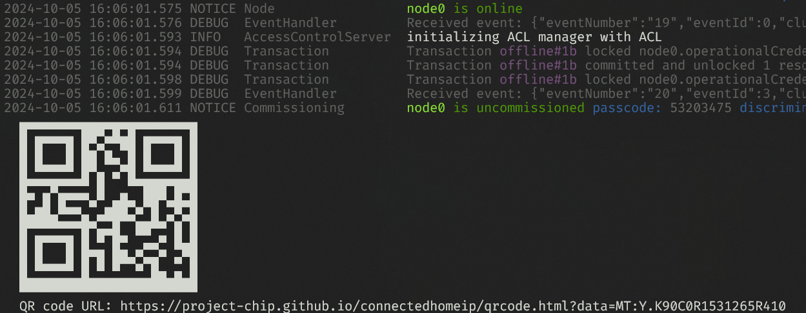

# Your own device with matter.js

## Running

If you have [Node.js](https://nodejs.org/) installed you can run yourself:

```
git clone git@github.com:lauckhart/matter-device
cd matter-device
npm install
node src/index.js
```

A QR code will print:



Scan the code to pair with your Matter controller.

## Hacking

Here's the source code:

```javascript
import { ServerNode } from "@matter/main";
import { OnOffLightDevice } from "@matter/main/devices/on-off-light";

const node = await ServerNode.create();

const light = await node.add(OnOffLightDevice);

light.events.onOff.onOff$Changed.on(value => console.log(`Light is now ${value}`));

await node.start();
```

If you prefer JavaScript[^1] see [src/index.js](./src/index.js).

If you prefer TypeScript[^2] see [src/index.ts](./src/index.ts).  You can compile with `npm run build`.

Note the files are the same except the extension.

[^1]: cough, masochist!
[^2]: cough, different kind of masochist!
